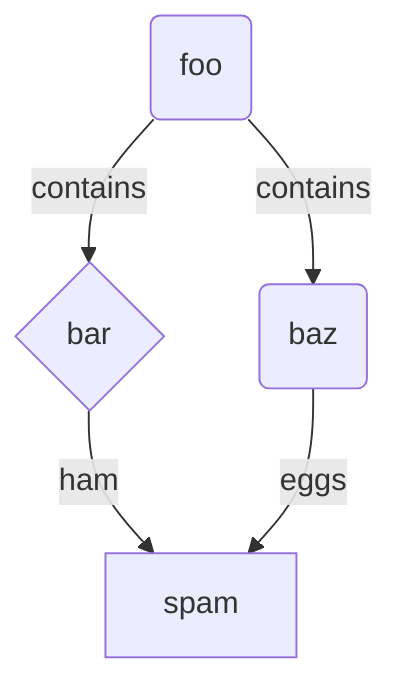

Mean field theory allows us to obtain a simplified partition function.
We will motivate this and provide an example.
In statistical physics, one would like to evaluate partition functions.
However, sometimes this evaluation is difficult
because of a "complicated" Hamiltonian.
In mean field theory, one replaces the "complicated" Hamiltonian with a "simple" one.
E.g. take the classical Ising model with its "complicated" Hamiltonian

\begin{align}
    H(s) = - J \sum_{\langle ij \rangle} s_i s_j -h \sum_i s_i,
\end{align}

where the $s_i \in \\{\pm 1\\}$ are spins associated to a site $i$ in a lattice of $N$ sites.
In mean field theory, this Hamiltonian gets replaced by the "simple" Hamiltonian
\begin{align}
    H(m) = - \frac{N}{2} J m^2 - N h m,
\end{align}
where
\begin{align}
    m(s) = \frac{1}{N}\sum_i s_i \in \\{-1, \dots, 1\\}
\end{align}
can be thought of as an effective magnetization.
Using these two Hamiltonians, one could evaluate their respective partition functions
\begin{align}
    \label{eq:partition_function}
    Z = \sum e^{-\beta H}.
\end{align}
There, in the case of the classical Ising model, 
one has a sum over all possible spin configurations $s_i \in \\{\pm 1\\}$.
However, for mean field theory, 
one has a sum over the effective magnetization $m \in \\{-1, \dots, 1\\}$ (and uses a weight given by the degeneracy of the magnetization therein). 
This fact greatly simplifies the computation of eq. \ref{eq:partition_function} for the mean field model.

