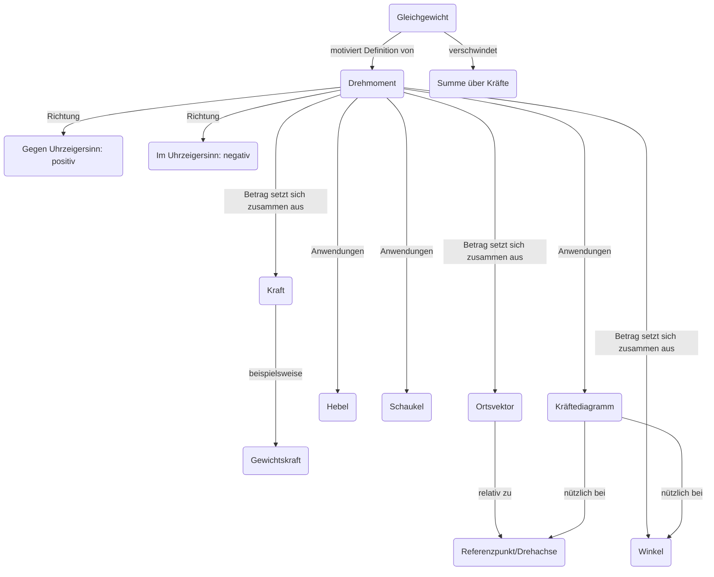

### Allgemeine Ziele
*   mathematische Fluency verbessern
*   typische algebraische und arithmetische Fehler besprechen
*   Drehmoment als nützliche Gleichgewichtsgrösse einführen

### Begriffe

*   Gleichgewicht
*   Kräfte
*   Drehmomente
*   Hebel
*   im/gegen Uhrzeigersinn
*   Schaukel
*   Referenzpunkt Wahl
*   Geometrie (i.e. $\sin \theta$)

### Lernziele L1
*   kennen Definition des Drehmoments
*   kennen Vorzeichenkonvention für Drehung
*   lösen Schaukel und zweiseitige Hebelaufgaben

### Lernziele L2
*   erinnern sich noch an Zusammenhang Masse, Volumen, Dichte
*   wissen, was beim einseitigen Hebel schiefläuft
*   wissen, dass der Referenzpunkt arbiträr ist
*   kennen die Winkelabhängigkeit

### Vorwissen und Schwierigkeiten

*   Gewichtskraft
*   evtl. Trigonometrie
*   evtl. Kräftediagramm
*   evtl. COM als Angriffspunkt der Gewichtskraft

*   Kraft
    *   Clusterbegriff für Energie und Impuls.
    *   Eine Kraft ändert die Geschwindigkeit eines Körpers.

### Evidenz

*   Lernende erklären sich Rechnungen gegenseitig in think pair share
*   Muddiest point nach hands on für den Begriff des Drehmoments

### Methoden

*   1(A) Advanced organizer: 
    *   Zusammenhängende Lektionen
    *   Überblick verschaffen
*   1(D) hands on: 
    *   Entdecken des Drehmoments [-> google: site:phet.colorado.edu balancing act -> wählen: intro](https://phet.colorado.edu/sims/html/balancing-act/latest/balancing-act_en.html)
*   1&2(C) think pair share: 
    *   Aufgabe Schaukel und Hebel
    *   Aufgabe Wahl des Referenzpunkts 
*   2(C) predict observe explain / productive failure: 
    *   Einseitiger Hebel

## Planung der Lektionen

|Zeit|Inhalt|
|--| ----------- |
|10'|IU & Advanced organizer|
|10'|Hands on: phet Simulation|
|5'|Muddiest point: Definition Drehmoment|
|15'|think pair share: Hebel/Schaukel|

|Zeit|Inhalt|
|--| ----------- |
|5'|IU & Repetition|
|10'|POE/failure: Einseitiger Hebel|
|10'|Muddiest point|
|15'|think pair share: Schaukel mit alt. Referenzpunkt/Sprungbrett|
