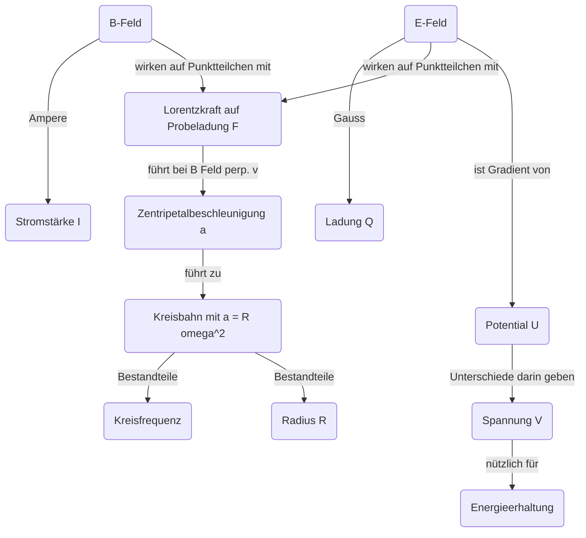

Allgemeine Ziele
-------

Kernfrage: Wie untersuche ich kleinste Strukturen?
Hier: e messen mit Fadenstrahlrohr!

Begriffe
-------------

(V): Vorwissen

*   B Feld(V)
*   Stromstärke I(V)
*   Ampere Gesetz I -> B(V)
*   Lorentzkraft(V)
*   Kreisbewegung(V)
*   Zentripetalkraft/Beschleunigung(V)
*   Energieerhaltung(V)
*   Spannung(V)
*   Potential(V)
*   Ladung(V)

Fehlkonzepte
-------

*   Kreisbewegung
    *   konstantes Tempo = Keine Beschleunigung
    *   Zentrifugalkraft zieht nach aussen
*   B-Felder
    *   Interpretation und Erstellen von Feldlinien sind schwierig
    *   Kompassnadel nicht als Magnet erkennen
    *   Nordpol ist eine positive Ladung (Ruhende Ladung beeinflusst Kompassnadel)
    *   Strom erzeugt E-Feld
*   Felder allgemein
    *   Stellen Wechselwirkung über Felder, e.g. in negativer Trommel wird positive Probeladung von naher Wand angezogen
    *   Unterscheidung Feld/Kraft unklar, e.g. negative Testladung erfährt Kraft in Richtung von Feldlinie
    *   Bahn folgt genau den Feldlinien: Beschleunigung v.s. Bahn
    *   Äquivalenz Vektorfeld/Feldlinien/Äquipotenziallinien unklar

Lernziele
--------

*   Drei Bier Regel anwenden für Richtung der Kraft auf Probeladung in Magnetfeld
*   Daumenregel für Richtung des Magnetfelds anwenden
*   Argumentieren, wieso Elektron Kreisbewegung ausführt
*   Dimensionsanalyse zur Bestimmung vom Radius anwenden
*   Energieerhaltung für Geschwindigkeitsbetrag in Abhängigkeit von Spannung und Ladung anwenden
*   Funktionsweise des Versuchs verstehen

Evidenz
-------

*   Clicker Fragen (Vorwissensbezogene Begriffe)
*   Concept Map/Summary zum Versuch erstellen

Ablauf
-----

|Zeit|Inhalt|Form|
|---|---|---|
|5'| IU & Repetition | Kollektiv|
|20'|Clicker|Gruppe/Kollektiv|
|10'|Fadenstrahlrohr|Kollektiv|
|evtl. 10'|Concept Map|Individuell|
|oder 10'|$n$ sentence summary|Individuell|
