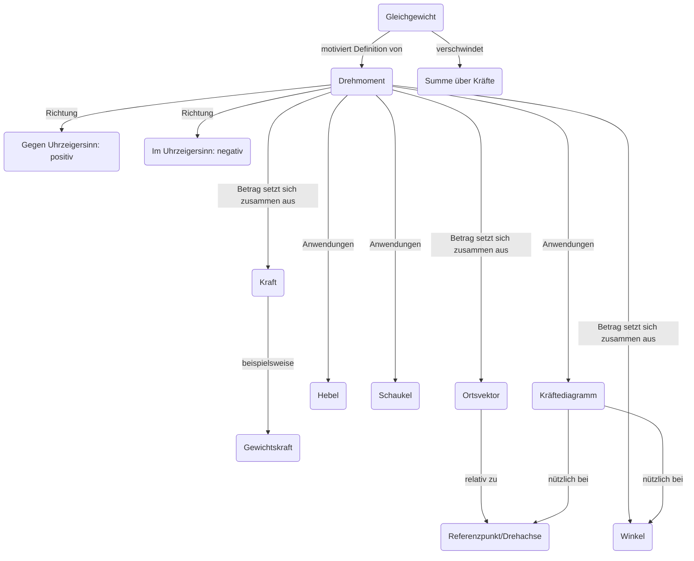

### Allgemeine Ziele
*   Mathematische Fluency verbessern.
*   Wie funktioniert ein Gleichgewicht? Hier: Summe über alle Drehmomente.
*   Alltagsanwendungen: Wippe, Schraubenzieher, Ratsche, ...

### Begriffe

(V): Vorwissen

*   Gleichgewicht
*   Kräfte(V)
*   Drehmomente
*   Hebel
*   im/gegen Uhrzeigersinn
*   Schaukel
*   Referenzpunkt Wahl
*   Geometrie (i.e. $\sin \theta$)

### Lernziele L1
*   kennen Definition des Drehmoments
*   kennen Vorzeichenkonvention für Drehung
*   lösen Schaukel und zweiseitige Hebelaufgaben

### Lernziele L2
*   wissen, was beim einseitigen Hebel schiefläuft
*   lösen Aufgabe zu einseitigem Hebel

### Vorwissen und Schwierigkeiten

*   Gewichtskraft
*   evtl. Trigonometrie
*   evtl. Kräftediagramm
*   evtl. COM als Angriffspunkt der Gewichtskraft

*   Kraft
    *   Clusterbegriff für Energie und Impuls
    *   Eine Kraft ändert die Geschwindigkeit eines Körpers

### Evidenz

*   1: Lernende erklären sich Rechnungen gegenseitig im Interview
*   1: Muddiest point nach hands on für den Begriff des Drehmoments
*   2: One sentence summary für einseitiger Hebel POE

### Methoden

*   1(A) Advanced organizer: 
    *   Zusammenhängende Lektionen
    *   Überblick verschaffen
*   1(D) hands on: 
    *   Entdecken des Drehmoments [-> google: site:phet.colorado.edu balancing act -> wählen: intro](https://phet.colorado.edu/sims/html/balancing-act/latest/balancing-act_en.html)
*   1(B) Interview: 
    *   Aufgabe Schaukel und Hebel
    *   Aufgabe Wahl des Referenzpunkts 
*   2(C) predict observe explain / productive failure: 
    *   Einseitiger Hebel - Gewichtskraft d. Hebels muss berücksichtigt werden

### Planung der Lektionen

|Zeit|Inhalt|Form|
|--| ----------- |---|
|10'|IU & Advanced organizer|Kollektiv|
|10'|Hands on: phet Simulation|Partner und Kollektiv|
|5'|Muddiest point: Definition Drehmoment|Kollektiv|
|15'|Interview: Hebel/Schaukel|Partner|

|Zeit|Inhalt|Form|
|--| ----------- |---|
|5'|IU & Repetition| Kollektiv|
|10'|POE: Zweiseitiger Hebel|Einzel, Kollektiv|
|10'|POE: Einseitiger Hebel|Einzel, Kollektiv|
|20'|Aufgabe einseitiger Hebel|Sandwich|
